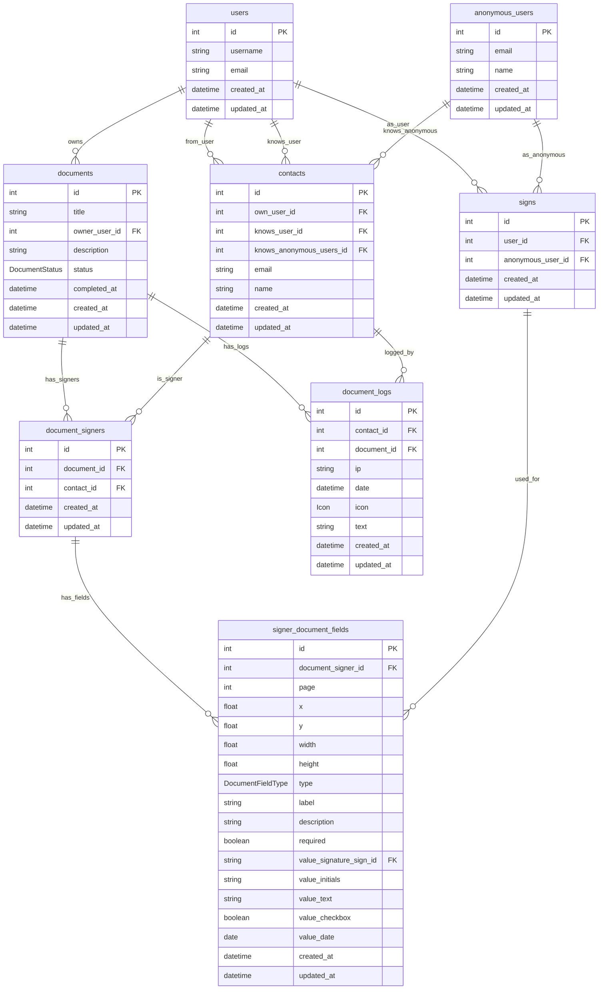

````mermaid
classDiagram
    class Icon {
        <<enum>>
        +create
        +send
        +watch
        +checkmark
    }

    class DocumentStatus {
        <<enum>>
        +draft
        +open
        +completed
        +template
    }

    class DocumentFieldType {
        <<enum>>
        +signature
        +initials
        +text
        +checkbox
        +date
    }
	```
````
