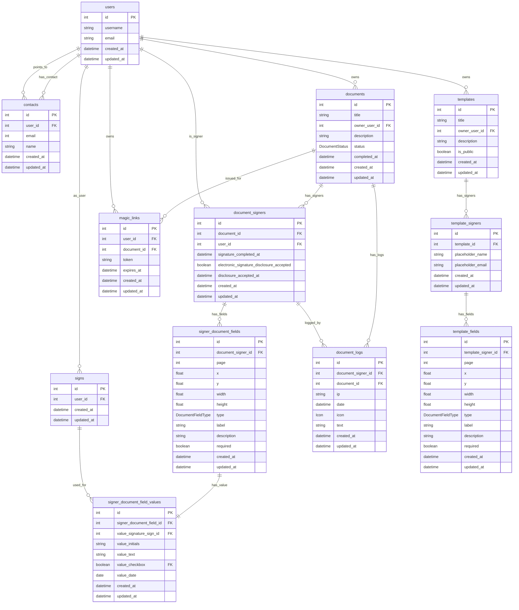
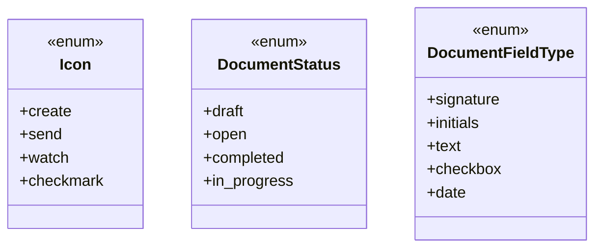

```mermaid
erDiagram
    users {
        int id PK
        string username
        string email
        datetime created_at
        datetime updated_at
    }

    contacts {
        int id PK
        int user_id FK
        int email
        string name
        datetime created_at
        datetime updated_at
    }

    signs {
        int id PK
        int user_id FK
        datetime created_at
        datetime updated_at
    }

    documents {
        int id PK
        string title
        int owner_user_id FK
        string description
        DocumentStatus status
        datetime completed_at
        datetime created_at
        datetime updated_at
    }

    document_signers {
        int id PK
        int document_id FK
        int user_id FK
        datetime signature_completed_at
        boolean electronic_signature_disclosure_accepted
        datetime disclosure_accepted_at
        datetime created_at
        datetime updated_at
    }

    signer_document_fields {
        int id PK
        int document_signer_id FK
        int page
        float x
        float y
        float width
        float height
        DocumentFieldType type
        string label
        string description
        boolean required
        datetime created_at
        datetime updated_at
    }

    signer_document_field_values {
        int id PK
        int signer_document_field_id FK
        int value_signature_sign_id FK
        string value_initials
        string value_text
        boolean value_checkbox FK
        date value_date
        datetime created_at
        datetime updated_at
    }

    document_logs {
        int id PK
        int document_signer_id FK
        int document_id FK
        string ip
        datetime date
        Icon icon
        string text
        datetime created_at
        datetime updated_at
    }

    magic_links {
        int id PK
        int user_id FK
        int document_id FK
        string token
        datetime expires_at
        datetime created_at
        datetime updated_at
    }

    templates {
        int id PK
        string title
        int owner_user_id FK
        string description
        boolean is_public
        datetime created_at
        datetime updated_at
    }

    template_signers {
        int id PK
        int template_id FK
        string placeholder_name
        string placeholder_email
        datetime created_at
        datetime updated_at
    }

    template_fields {
        int id PK
        int template_signer_id FK
        int page
        float x
        float y
        float width
        float height
        DocumentFieldType type
        string label
        string description
        boolean required
        datetime created_at
        datetime updated_at
    }

    %% Beziehungen
    users ||--o{ documents                   : "owns"
    users ||--o{ contacts                    : "has_contact"
    contacts }o--|| users                    : "points_to"
    users ||--o{ signs                       : "as_user"
    documents ||--o{ document_signers        : "has_signers"
    users ||--o{ document_signers         : "is_signer"
    document_signers ||--o{ signer_document_fields : "has_fields"
    signer_document_fields ||--|| signer_document_field_values : "has_value"
    signs ||--o{ signer_document_field_values : "used_for"
    documents ||--o{ document_logs           : "has_logs"
    document_signers ||--o{ document_logs            : "logged_by"
    documents ||--o{ magic_links               : "issued_for"
    users ||--o{ magic_links               : "owns"
    users ||--o{ templates                   : "owns"
    templates ||--o{ template_signers        : "has_signers"
    template_signers ||--o{ template_fields  : "has_fields"
```

```mermaid
classDiagram
    class Icon {
        <<enum>>
        +create
        +send
        +watch
        +checkmark
    }

    class DocumentStatus {
        <<enum>>
        +draft
        +open
        +completed
        +in_progress
    }

    class DocumentFieldType {
        <<enum>>
        +signature
        +initials
        +text
        +checkbox
        +date
    }
```
